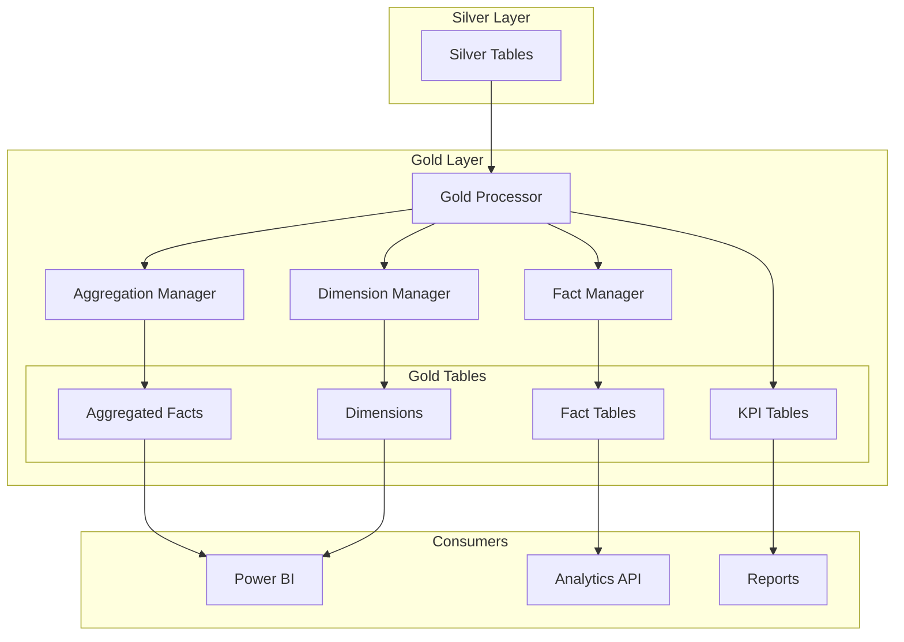
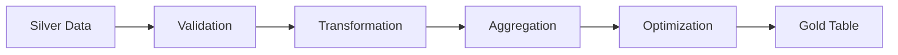
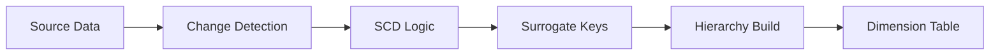

# Gold Layer Implementation

The Gold layer represents the business-ready layer of the medallion architecture, containing aggregated data, calculated metrics, and optimized structures for analytics and reporting.

## Overview

The Gold layer transforms cleaned Silver layer data into business-focused datasets that directly support analytics, reporting, and decision-making. This layer implements dimensional modeling, pre-calculated aggregations, and performance-optimized structures.

## Status

**🚧 Under Development**: The Gold layer processor is currently being implemented. This documentation describes the planned architecture and features.

## Planned Architecture



## Planned Components

### GoldProcessor (Coming Soon)

The main processor responsible for:
- Orchestrating Gold layer transformations
- Managing aggregation pipelines
- Implementing dimensional modeling
- Creating business metrics

### AggregationType (Coming Soon)

Enumeration of supported aggregation types:
- `SUM`: Additive measures
- `AVG`: Average calculations
- `COUNT`: Row counts and distinct counts
- `MIN/MAX`: Range calculations
- `CUSTOM`: User-defined aggregations

### GoldTableConfig (Coming Soon)

Configuration for Gold layer tables:
- Aggregation definitions
- Dimension hierarchies
- Fact grain specifications
- Refresh schedules

## Planned Features

### 1. Dimensional Modeling
- Star schema implementation
- Snowflake schema support
- Slowly Changing Dimensions (SCD)
- Hierarchies and levels

### 2. Pre-Aggregated Metrics
- Sales metrics by period
- Inventory snapshots
- Customer analytics
- Performance KPIs

### 3. Optimization Strategies
- Materialized views
- Indexed aggregations
- Partitioning strategies
- Compression techniques

### 4. Business Rules Engine
- Calculated measures
- Business logic implementation
- KPI definitions
- Threshold monitoring

## Planned Usage

### Basic Aggregation Example
```python
from core.medallion.gold import GoldProcessor, AggregationType
from core.settings import get_settings

# Initialize (future implementation)
settings = get_settings()
processor = GoldProcessor(settings)

# Define aggregation
aggregation_config = {
    "source_table": "silver.sales_cleaned",
    "target_table": "gold.sales_summary",
    "group_by": ["product_id", "date_key"],
    "aggregations": [
        {
            "column": "sales_amount",
            "type": AggregationType.SUM,
            "alias": "total_sales"
        },
        {
            "column": "quantity",
            "type": AggregationType.SUM,
            "alias": "total_quantity"
        }
    ]
}

# Process aggregation
result = await processor.create_aggregation(aggregation_config)
```

### Dimensional Modeling Example
```python
# Define dimension (future implementation)
dimension_config = {
    "source_table": "silver.customer_cleaned",
    "target_table": "gold.dim_customer",
    "type": "SCD2",
    "business_key": "customer_id",
    "attributes": [
        "customer_name",
        "customer_segment",
        "customer_region"
    ],
    "effective_date": "valid_from",
    "end_date": "valid_to"
}

# Create dimension
result = await processor.create_dimension(dimension_config)
```

## Planned Configuration

### Gold Layer Settings

| Setting | Environment Variable | Default | Description |
|---------|---------------------|---------|-------------|
| `schema_name` | `CTE_MEDALLION__GOLD__SCHEMA_NAME` | gold | Target schema name |
| `enable_caching` | `CTE_MEDALLION__GOLD__ENABLE_CACHING` | true | Cache aggregation results |
| `refresh_interval` | `CTE_MEDALLION__GOLD__REFRESH_INTERVAL` | 3600 | Refresh interval in seconds |
| `parallel_aggregations` | `CTE_MEDALLION__GOLD__PARALLEL_AGG` | 4 | Number of parallel aggregations |

## Design Patterns

### 1. Aggregation Pipeline


### 2. Dimension Processing


## Best Practices

### 1. Aggregation Design
- Define clear grain for each fact table
- Ensure aggregations are additive
- Document business rules clearly
- Version control metric definitions

### 2. Performance Optimization
- Use appropriate indexes
- Implement partitioning strategies
- Schedule refreshes during low-usage periods
- Monitor query patterns

### 3. Data Quality
- Validate aggregation results
- Implement reconciliation checks
- Monitor for data anomalies
- Maintain audit trails

## Common Gold Layer Tables

### 1. Sales Analytics
```sql
-- gold.fact_sales_daily
CREATE TABLE gold.fact_sales_daily AS
SELECT 
    date_key,
    product_key,
    customer_key,
    SUM(sales_amount) as total_sales,
    SUM(quantity) as total_quantity,
    COUNT(DISTINCT order_id) as order_count
FROM silver.sales_cleaned
GROUP BY date_key, product_key, customer_key
```

### 2. Customer Metrics
```sql
-- gold.customer_lifetime_value
CREATE TABLE gold.customer_lifetime_value AS
SELECT 
    customer_key,
    FIRST(first_purchase_date) as first_purchase,
    SUM(total_purchases) as lifetime_value,
    AVG(purchase_frequency) as avg_frequency
FROM silver.customer_transactions
GROUP BY customer_key
```

### 3. Inventory Snapshots
```sql
-- gold.inventory_daily_snapshot
CREATE TABLE gold.inventory_daily_snapshot AS
SELECT 
    snapshot_date,
    warehouse_key,
    product_key,
    SUM(quantity_on_hand) as total_quantity,
    SUM(quantity_on_hand * unit_cost) as inventory_value
FROM silver.inventory_movements
GROUP BY snapshot_date, warehouse_key, product_key
```

## Future Enhancements

### Phase 1: Core Implementation
- Basic aggregation processor
- Simple dimension creation
- Manual refresh triggers

### Phase 2: Advanced Features
- Complex aggregation types
- SCD Type 2 automation
- Incremental processing
- Data quality scoring

### Phase 3: Enterprise Features
- Real-time aggregations
- ML-driven metrics
- Predictive analytics
- Advanced optimization

## Migration Guide

When the Gold processor is implemented, existing gold layer logic can be migrated:

1. **Identify Current Aggregations**: Document existing SQL/stored procedures
2. **Map to New Configuration**: Convert to GoldTableConfig format
3. **Test in Parallel**: Run new processor alongside existing logic
4. **Validate Results**: Ensure aggregations match
5. **Cutover**: Switch to new processor

## See Also

- [Medallion Architecture Overview](../README.md)
- [Silver Layer Documentation](../silver/README.md) (Coming soon)
- [Bronze Layer Documentation](../bronze/README.md)
- [Snapshot Layer Documentation](../snapshot/README.md)