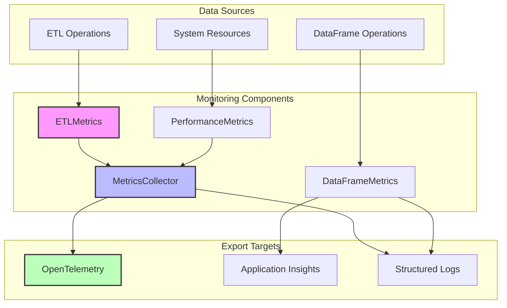
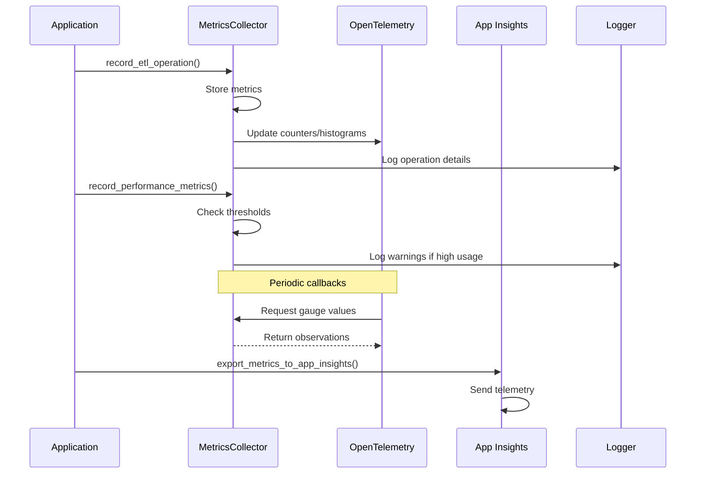

# Monitoring Sub-Package

## Overview

The `core.monitoring` sub-package provides comprehensive metrics collection, performance tracking, and telemetry capabilities for the medalflow ETL framework. It integrates with Azure Application Insights and OpenTelemetry to provide real-time monitoring and observability of ETL operations, system performance, and DataFrame processing activities.

## Purpose

This monitoring infrastructure enables:

- **ETL Operation Tracking**: Monitor success rates, duration, and row counts for all medallion layer operations
- **Performance Monitoring**: Track CPU, memory, disk I/O, and network usage
- **DataFrame Engine Metrics**: Compare performance across Pandas and Polars engines
- **Error Analysis**: Categorize and track errors for troubleshooting
- **Real-time Observability**: Export metrics to Azure Application Insights and OpenTelemetry

## Architecture

### Component Overview



### Data Flow



## Core Components

### 1. ETLMetrics

Captures metrics for individual ETL operations:
- **Operation Type**: create_table, execute_query, etc.
- **Medallion Layer**: bronze, silver, gold, snapshot
- **Performance Data**: duration, rows processed, bytes processed
- **Status**: success/failure with error details
- **Metadata**: engine type, query type, timestamps

### 2. PerformanceMetrics

Monitors system resource utilization:
- **CPU Usage**: Percentage utilization
- **Memory**: Usage in MB
- **Disk I/O**: Read/write throughput
- **Network I/O**: Data transfer rates
- **Connections**: Active database connections

### 3. DataFrameMetrics

Tracks DataFrame engine performance:
- **Engine Comparison**: Pandas vs Polars performance
- **Format Statistics**: Usage by file format (CSV, Parquet, etc.)
- **Operation Timing**: Read/write duration tracking
- **Error Rates**: Engine-specific error tracking

### 4. MetricsCollector

Central orchestrator for all metrics:
- **OpenTelemetry Integration**: Counters, histograms, and gauges
- **Metric Aggregation**: Time-window based summaries
- **Retention Management**: Automatic cleanup of old metrics
- **Real-time Monitoring**: Active operation tracking

## Usage Examples

### Basic ETL Operation Monitoring

```python
from datetime import datetime
from core.monitoring import ETLMetrics, MetricsCollector
from core.settings import get_settings

# Initialize collector
settings = get_settings()
collector = MetricsCollector(settings)

# Record a successful ETL operation
metrics = ETLMetrics(
    operation="create_table",
    layer="bronze",
    table_name="sales_data",
    rows_processed=150000,
    duration_seconds=12.5,
    success=True,
    engine_type="synapse",
    query_type="CREATE_EXTERNAL_TABLE",
    bytes_processed=52428800  # 50MB
)

collector.record_etl_operation(metrics)
```

### Monitoring Failed Operations

```python
# Record a failed operation
failed_metrics = ETLMetrics(
    operation="execute_query",
    layer="silver",
    table_name="customer_aggregates",
    rows_processed=0,
    duration_seconds=30.0,
    success=False,
    error_message="Query timeout: exceeded 30 second limit",
    engine_type="fabric",
    query_type="MERGE"
)

collector.record_etl_operation(failed_metrics)
```

### System Performance Monitoring

```python
from core.monitoring.metrics import PerformanceMetrics

# Record system metrics
perf_metrics = PerformanceMetrics(
    cpu_percent=65.5,
    memory_mb=4096.0,
    disk_io_mb=125.3,
    network_io_mb=89.7,
    active_connections=15
)

collector.record_performance_metrics(perf_metrics)
```

### Getting Metrics Summary

```python
from datetime import timedelta

# Get hourly summary
summary = collector.get_metrics_summary(time_window=timedelta(hours=1))

print(f"Success rate: {summary['success_rate']:.2%}")
print(f"Total operations: {summary['total_operations']}")
print(f"Average duration: {summary['average_duration_seconds']:.2f}s")
print(f"Operations by layer: {summary['operations_by_layer']}")
print(f"Error types: {summary['errors_by_type']}")
```

### Exporting to Application Insights

```python
from core.monitoring.dataframe_metrics import export_metrics_to_app_insights

# Export DataFrame metrics
await export_metrics_to_app_insights(
    instrumentation_key="your-app-insights-key"
)
```

## Configuration Requirements

### Environment Variables

The monitoring system respects the following settings:

```bash
# Core monitoring configuration
CTE_MONITORING__ENABLED=true
CTE_MONITORING__RETENTION_DAYS=7
CTE_MONITORING__EXPORT_INTERVAL_SECONDS=300

# Application Insights (optional)
CTE_MONITORING__APP_INSIGHTS_KEY=your-instrumentation-key

# OpenTelemetry (optional)
CTE_MONITORING__OTEL_ENDPOINT=http://localhost:4317
CTE_MONITORING__OTEL_SERVICE_NAME=medalflow
CTE_MONITORING__OTEL_SERVICE_VERSION=2.0.0
```

### OpenTelemetry Instruments

The following OpenTelemetry instruments are automatically created:

| Instrument Type | Name | Description |
|----------------|------|-------------|
| Counter | `etl_operations_total` | Total number of ETL operations |
| Counter | `etl_rows_processed_total` | Total rows processed |
| Counter | `etl_bytes_processed_total` | Total bytes processed |
| Counter | `etl_errors_total` | Total number of errors |
| Histogram | `etl_operation_duration_seconds` | Duration of ETL operations |
| Histogram | `etl_rows_per_operation` | Rows processed per operation |
| Gauge | `etl_active_operations` | Currently active operations |
| Gauge | `etl_success_rate` | Operation success rate |
| Gauge | `system_cpu_percent` | System CPU usage |
| Gauge | `system_memory_mb` | System memory usage |

## Best Practices

### 1. Metric Recording

- **Always record metrics**: Even for failed operations to maintain accurate statistics
- **Include context**: Provide engine_type, query_type, and other metadata
- **Measure accurately**: Use precise timing for duration measurements
- **Handle errors gracefully**: Record errors without interrupting the main flow

### 2. Performance Monitoring

- **Set thresholds**: Monitor for high CPU (>80%) and memory (>8GB) usage
- **Regular collection**: Record performance metrics at consistent intervals
- **Correlate with operations**: Link performance spikes to specific ETL operations

### 3. DataFrame Monitoring

- **Use decorators**: Apply `@monitor_dataframe_operation` for automatic tracking
- **Compare engines**: Use metrics to make informed decisions about engine selection
- **Track formats**: Monitor which file formats are most commonly used

### 4. Metric Retention

- **Clean old metrics**: Use `clear_old_metrics()` to prevent memory growth
- **Export before cleanup**: Ensure metrics are exported to persistent storage
- **Configure retention**: Adjust retention period based on analysis needs

### 5. Integration

- **Structured logging**: All metrics are logged with structured format
- **OpenTelemetry**: Leverage the full OpenTelemetry ecosystem
- **Application Insights**: Use for Azure-native monitoring
- **Custom dashboards**: Build dashboards using exported metrics

## Integration with ETL Pipeline

### Bronze Layer Integration

```python
from core.monitoring import ETLMetrics, MetricsCollector

class BronzeProcessor:
    def __init__(self):
        self.collector = MetricsCollector(get_settings())
    
    async def create_bronze_table(self, table_name: str):
        start_time = time.time()
        rows = 0
        
        try:
            # Process bronze table
            rows = await self._process_table(table_name)
            
            # Record success
            self.collector.record_etl_operation(ETLMetrics(
                operation="create_bronze_table",
                layer="bronze",
                table_name=table_name,
                rows_processed=rows,
                duration_seconds=time.time() - start_time,
                success=True,
                engine_type=self.platform.engine_type
            ))
            
        except Exception as e:
            # Record failure
            self.collector.record_etl_operation(ETLMetrics(
                operation="create_bronze_table",
                layer="bronze",
                table_name=table_name,
                rows_processed=0,
                duration_seconds=time.time() - start_time,
                success=False,
                error_message=str(e),
                engine_type=self.platform.engine_type
            ))
            raise
```

### Silver Layer Integration

```python
class SilverProcessor:
    def __init__(self):
        self.collector = MetricsCollector(get_settings())
    
    async def execute_silver_transformation(self, config):
        # Monitor each silver transformation
        with self._monitor_operation(config):
            await self._execute_transformation(config)
    
    def _monitor_operation(self, config):
        return OperationMonitor(
            collector=self.collector,
            operation="silver_transformation",
            layer="silver",
            table_name=config.table_name
        )
```

## Advanced Topics

### Custom Metrics

Extend the monitoring system with custom metrics:

```python
from dataclasses import dataclass
from core.monitoring.metrics import ETLMetrics

@dataclass
class CustomETLMetrics(ETLMetrics):
    """Extended metrics with custom fields."""
    
    partition_count: int = 0
    compression_ratio: float = 1.0
    schema_version: str = "1.0"
    
    def to_dict(self):
        data = super().to_dict()
        data.update({
            "partition_count": self.partition_count,
            "compression_ratio": self.compression_ratio,
            "schema_version": self.schema_version
        })
        return data
```

### Alerting Integration

```python
class MetricAlerter:
    """Send alerts based on metric thresholds."""
    
    def __init__(self, collector: MetricsCollector):
        self.collector = collector
    
    async def check_alerts(self):
        summary = self.collector.get_metrics_summary()
        
        # Alert on low success rate
        if summary['success_rate'] < 0.95:
            await self._send_alert(
                "Low ETL success rate",
                f"Success rate: {summary['success_rate']:.2%}"
            )
        
        # Alert on high error count
        if summary['failed_operations'] > 10:
            await self._send_alert(
                "High ETL failure count",
                f"Failed operations: {summary['failed_operations']}"
            )
```

### Performance Optimization

Monitor and optimize based on metrics:

```python
class AdaptiveProcessor:
    """Adjust processing based on performance metrics."""
    
    def __init__(self):
        self.collector = MetricsCollector(get_settings())
    
    async def process_with_monitoring(self, tables):
        # Check current system load
        perf_metrics = self._get_current_performance()
        
        # Adjust batch size based on available resources
        if perf_metrics.cpu_percent > 70:
            batch_size = 100  # Smaller batches
        else:
            batch_size = 1000  # Larger batches
        
        # Process with adapted parameters
        for batch in self._batch(tables, batch_size):
            await self._process_batch(batch)
```

## Troubleshooting

### Common Issues

1. **Metrics not appearing in OpenTelemetry**
   - Verify OTEL endpoint is accessible
   - Check that meters are properly initialized
   - Ensure callbacks are being triggered

2. **High memory usage from metrics**
   - Implement regular cleanup with `clear_old_metrics()`
   - Reduce retention period
   - Export metrics more frequently

3. **Application Insights integration failing**
   - Verify instrumentation key is correct
   - Check network connectivity to Azure
   - Ensure `applicationinsights` package is installed

4. **DataFrame metrics missing**
   - Verify decorator is applied to methods
   - Check that engine detection is working
   - Ensure async/sync wrapper matches method type

### Debug Mode

Enable detailed monitoring logs:

```python
import logging
logging.getLogger("core.monitoring").setLevel(logging.DEBUG)
```

## Future Enhancements

Planned improvements to the monitoring system:

1. **Distributed Tracing**: Full trace context propagation across services
2. **Custom Dashboards**: Pre-built Grafana/PowerBI dashboards
3. **Anomaly Detection**: ML-based detection of unusual patterns
4. **Cost Tracking**: Monitor and optimize cloud resource costs
5. **Data Quality Metrics**: Track data quality indicators
6. **SLA Monitoring**: Track and alert on SLA violations

## Related Documentation

- [MedalFlow Architecture](../README.md)
- [Settings Configuration](../settings/README.md)
- [Logging Infrastructure](../logging/README.md)
- [Azure Integration](../compute/README.md)