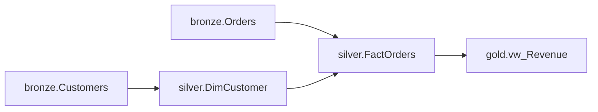

# A MedalFlow project

> [!WARNING]
> MedalFlow is a **work in progress**: pre-release, unpublished, and not API-stable.
> This example is kept working by CI, but the contract it demonstrates still changes.
> See the [project README](../README.md#status-work-in-progress) before building on it.

A complete, working MedalFlow project: five models across the three medallion
layers, a `.env.example` listing everything it needs, and a five-line entry
point. Copy this directory, rename it, replace the models with yours.

It is also the project MedalFlow's own end-to-end suite compiles and runs.
There is no second copy of it anywhere in the repository, which is the point:
if this example breaks, CI goes red.

## Run it

From this directory, with Python 3.13+:

```bash
pip install medalflow        # not yet on PyPI -- see the note below
cp .env.example .env
python run.py
```

```
stage 1: Customers, Orders
stage 2: DimCustomer
stage 3: FactOrders
stage 4: vw_Revenue
```

No warehouse, no credentials, no network. Compiling is offline by design, and
`.env.example` has no connection string in it because none is needed to get
that output.

MedalFlow is not published to PyPI yet, so until it is, install it from a
clone of this repository instead:

```bash
pip install /path/to/medalflow      # the repository root
```

## What the five models are

```
models/
├── bronze/
│   ├── customers.py     Customers    dbo.Customers    -> bronze.Customers
│   └── orders.py        Orders       dbo.SalesOrders  -> bronze.Orders
├── silver/
│   ├── customers.py     DimCustomer  bronze.Customers -> silver.DimCustomer
│   └── orders.py        FactOrders   bronze.Orders
│                                     silver.DimCustomer -> silver.FactOrders
└── gold/
    └── revenue.py       Revenue      silver.FactOrders  -> gold.vw_Revenue
```

**Bronze** lands raw source tables, one model per table, and writes no SQL at
all. `@bronze_metadata` names the model, the schema it lands in, the system it
came from, and — when the source table is named differently from the model —
the source table. `Orders` is that case: `dbo.SalesOrders` arrives as
`bronze.Orders`.

**Silver** cleanses and conforms. Each `@query_metadata` method returns a
`SELECT`, and MedalFlow wraps it in the DDL its `type=` names. `DimCustomer`
reads bronze; `FactOrders` reads bronze *and* another silver model, which is
what puts it in a later stage than the model it joins to.

**Gold** is what the business reads. `Revenue` builds a view rather than a
table — `QueryType.CREATE_OR_ALTER_VIEW` instead of `CREATE_TABLE` — and it is
the only model here whose object name differs from its model name, because the
method's `table_name=` says `vw_Revenue`.

## Where the DAG comes from

Nothing in `models/` declares a dependency. There is no `depends_on`, no
`ref()`, no ordering, and no edge list. Every arrow above was read out of the
`SELECT` statements themselves.

`silver/orders.py` says, in full:

```python
@query_metadata(type=QueryType.CREATE_TABLE, table_name="FactOrders")
def build_fact_orders(self) -> str:
    return (
        "SELECT o.OrderId, c.CustomerId "
        "FROM bronze.Orders o "
        "JOIN silver.DimCustomer c ON c.CustomerId = o.CustomerId"
    )
```

MedalFlow parses that with [sqlglot](https://github.com/tobymao/sqlglot),
takes `bronze.Orders` and `silver.DimCustomer` as the tables it reads, takes
`silver.FactOrders` as the table it writes, and matches those names against
every other model's write targets — across layers, not only within one. Two
edges fall out, and `FactOrders` cannot be planned before either of the models
on the other end of them.



Levelling that graph is the four stages `run.py` prints. `Customers` and
`Orders` depend on nothing and on each other not at all, so they share stage 1
and could run in parallel. The rest is a chain, so it is three more stages.

Rename a table in one model's SQL and the plan changes shape on the next
compile. Introduce a cycle — two models reading each other — and `compile()`
returns a `Circular dependency` error with an empty plan, rather than a plan
that cannot run. `run.py` stops there and prints it.

## Compiling part of it

`compile()` and `run()` both take a selector. The grammar is four forms:

| Selector | Selects |
|---|---|
| `*` | every model |
| `layer:bronze` `layer:silver` `layer:gold` | one medallion layer |
| `tag:daily` | every model carrying that tag, in any layer |
| `DimCustomer` | one model, by the `name` its decorator declares |

```python
>>> from medalflow.api import compile
>>> [model.name for model in compile("layer:gold").models]
['Revenue']
>>> sorted(model.name for model in compile("tag:daily").models)
['DimCustomer', 'Revenue']
>>> compile("DimCustomer").plan.total_queries
1
```

`tag:daily` crossing from silver to gold is the reason tags exist: a schedule
is rarely a layer.

`+DimCustomer` and `DimCustomer+` — a model and everything upstream or
downstream of it — are recognised and refused by name. They are reserved for a
later release, not silently ignored.

## Executing the plan

`python run.py` compiles. Executing what it compiled is `run()`, which takes
the same selector and does open a warehouse connection:

```python
from medalflow.api import run

result = run("*")
```

That needs the deployment variables this project's `.env.example` deliberately
omits — a storage account and a Key Vault holding the ODBC string. They are
documented in the repository root's [`.env.example`](../.env.example), and
executing against a live warehouse is the part of MedalFlow no test covers
yet. The repository [README](../README.md) says which is which.

## Making it yours

1. Copy this directory and rename it.
2. Empty `models/bronze`, `models/silver` and `models/gold`, keeping the
   `__init__.py` in each — they are what makes the layers importable packages.
3. Point `MEDALFLOW_MODELS_PACKAGE` at your package. It is the parent: set it
   to `acme_warehouse` and MedalFlow walks `acme_warehouse.bronze`,
   `acme_warehouse.silver` and `acme_warehouse.gold`. If your layers are not
   siblings, name them individually with `MEDALFLOW_BRONZE_PACKAGE` and
   friends.
4. Write models. Run `python run.py` after each one; a clean compile is the
   fastest feedback MedalFlow has, and it needs nothing running.
